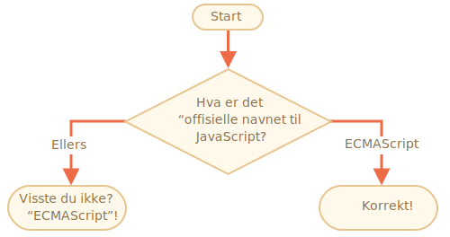

viktighet: 2

---

# JavaScript sitt navn

Ved å bruke `if..else` skal du skrive kode som spør: 'Hva er det "offisielle" navnet til JavaScript'

<<<<<<< HEAD
Hvis brukeren skriver inn "ECMAScript", skal tilbakemeldingen være "Korrekt!". Ellers skal den være: "Visste du det ikke? ECMAScript!"
=======
If the visitor enters "ECMAScript", then output "Right!", otherwise -- output: "You don't know? ECMAScript!"
>>>>>>> a6fdfda09570a8ce47bb0b83cd7a32a33869cfad

[demo src="ifelse_task2"]
